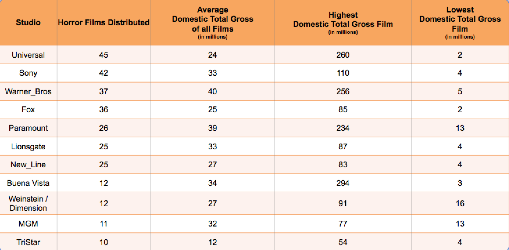
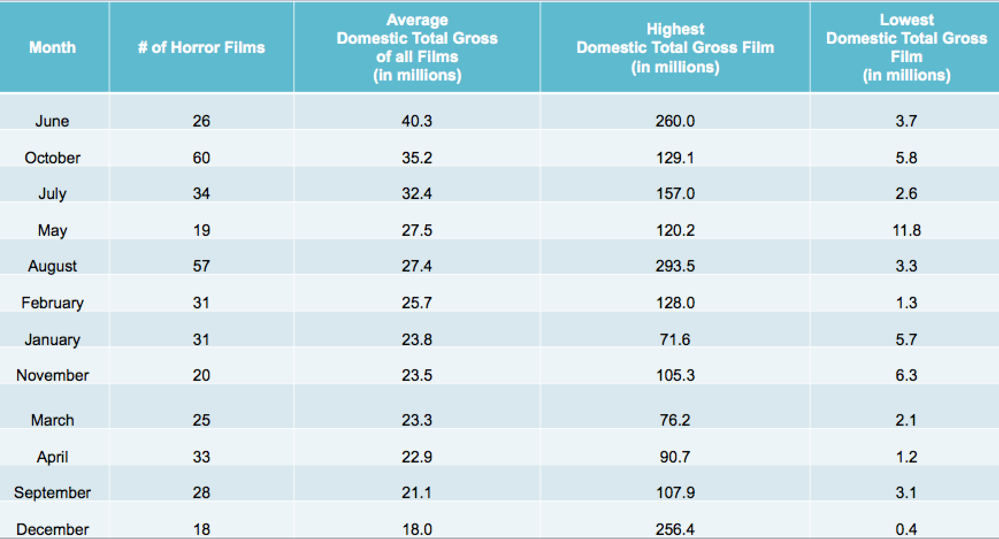

<b>Eric Xu -- luther MVP submission -- 9/17/2014 -- Summary of Progress<b>

Client : A horror filmmaker planning a wide release film and is in the process of choosing a distributor/studio.

Client’s request :  How can I increase the total domestic gross of the movie I create? (e.g. insight onto: month of release,# of theaters to wide release in, specific horror genre film to make, which major studio to choose, etc.)

Dataset : All films from BoxOfficeMojo with keyword "Horror":

  - Horror - Period
  - Horror - Slasher
  - Horror - Supernatural
  - Horror - Terror in the Water
  - Horror - Torture
  - Horror - Anthology
  - Horror - Comedy
  - Horror - Remake
  - Sci-Fi Horror

Features (to choose from in dataset) : 

  - domestic total gross 
  - log domestic total gross
  - studio
  - number of theaters at widest release
  - budget
  - month and season of release
  - year of release
  - movie rating (e.g. PG)
  - runtime

WIDE RELEASE MOVIE

A wide release movie plays at 600 theaters or more at its widest release (http://www.boxofficemojo.com/about/boxoffice.htm ).  Because my client is planning a wide release movie, movies released at less than 600 theaters in its widest release will not be used in the regression. The following is a histogram of the number of theaters at each wide release horror movie:

STUDIO

The client is only interested in the top studios for distribution.  The client claims that (1) the studio's experience can be a great asset in increasing gross and (2) studios without much experience carry a lot of risk and can simply be lucky.  The following is a table showing the studios making the most horror films as well as domestic total gross information:

From the table, the studios 
- Universal
- Sony
- Warner Bros
- Fox
- Paramount
- Lionsgate
- New Line
- Buena Vista
- Weinstein/Dimension
- MGM 

all have at least 10 horror films distributed.  These will be the experienced horror film studios.  To help my client choose the most successful of these experienced studios and avoid others, I created dummy variables for these 10 top horror studios and one for all other studios for the regression to predict gross. 

MONTH OF RELEASE

The month of release of the film is a factor I would like to advise my client on.  The following is a table showing the domestic gross information with respect to the month of release of the movie:

From the table, June horror films have the highest mean domestic gross.  Using a regression with month of release and theater number, we find that June is a great month to release the horror film but January and April are bad months. 

RUNTIME

The runtime does not significantly affect the film's gross.

SPECIFIC GENRE

The specific genre of the filmmaker's horror film is another feature I would like to advise my client on.  These are the specific horror genres:
  - Period
  - Slasher
  - Supernatural
  - Terror in the Water
  - Torture
  - Anthology
  - Comedy
  - Remake
  - Sci-Fi

The following is a table showing the domestic gross information with respect to the specific horror genre: (TO BE CONTINUED)

DOMESTIC GROSS

The dependent measure that we want to maximize for the client is total domestic gross.  Analysis of this dependent measure via histogram reveals a high positive skew.  
  
  
By changing this dependent measure to the log of the total domestic gross, we can see a dramatic reduction in the skew.  This will be our dependent measure as the approximation made by the central limit theorem will be improved.

