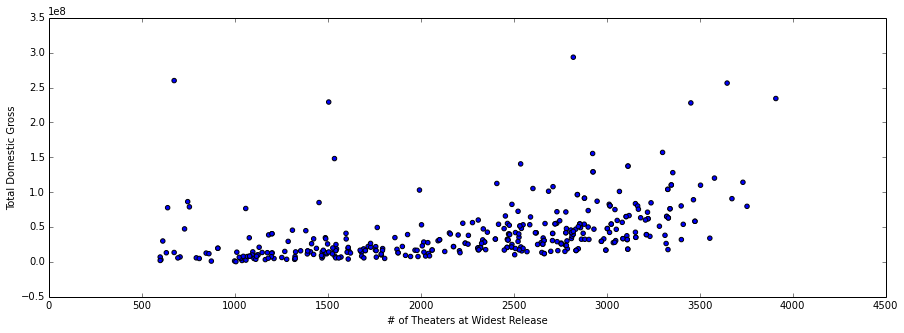
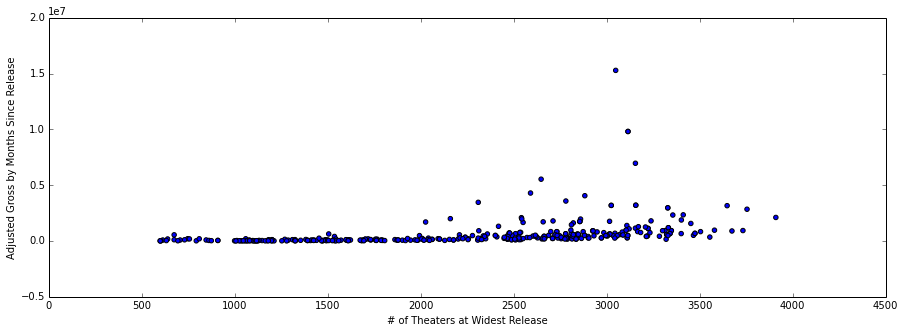
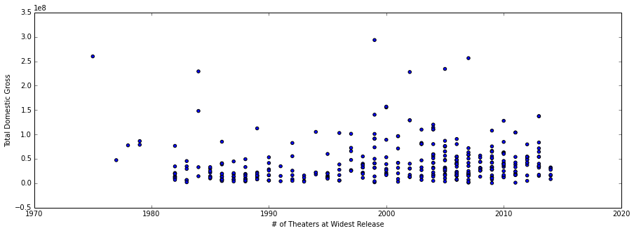
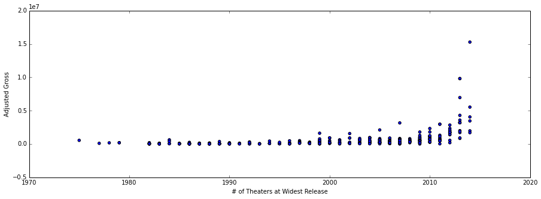

<b>Eric Xu -- luther MVP submission -- 9/16/2014 -- Summary of Progress<b>

Client : A horror filmmaker

Client’s request :  How can I increase the total domestic gross of the movie I create?

Dataset : All films from BoxOfficeMojo with keyword "Horror":

  - Horror - Period
  - Horror - Slasher
  - Horror - Supernatural
  - Horror - Terror in the Water
  - Horror - Torture
  - Horror - Anthology
  - Horror - Comedy
  - Horror - Remake
  - Sci-Fi Horror

Features (to choose from in dataset) : 

  - domestic total gross (raw and logged)
  - adjusted total gross (raw and logged) based on number of months since release
  - studio
  - number of theaters at widest release
  - budget
  - month and season of release
  - year of release
  - movie rating (e.g. PG)
  - runtime

1.  Ultimately, our dependent measure that we want to maximize for the client is total domestic gross.  However, movies that were out longer in the past have an unfair advantage on this measure due to further time for movie and DVD sales to accrue.  In order to account for this, I adjusted the total gross based on the number of months since the film was released from September 2014. 

2.  A wide release movie plays at 600 theaters or more at its widest release ( reference: http://www.boxofficemojo.com/about/boxoffice.htm ).  Because my client is planning a wide release movie, I will drop all movies released at less than 600 theaters in the dataset due to irrelevance.

3.  Since my client is interested in top horror studios, I created a table to find out what they were:

From the table, Universal, Sony, Warner Bros, Fox, Paramount, New Line, and Lionsgate are all studios that have created at least 20 horror films.  I created dummy variables for these top horror studios (and for 'other studio') to see whether my client would benefit in choosing one of these top studios to distribute the movie.

4.  I was also curious whether the year of the horror film as well as the number of theaters at its widest release had an effect on the gross.  I scatterplotted both of these independent measures against gross.

