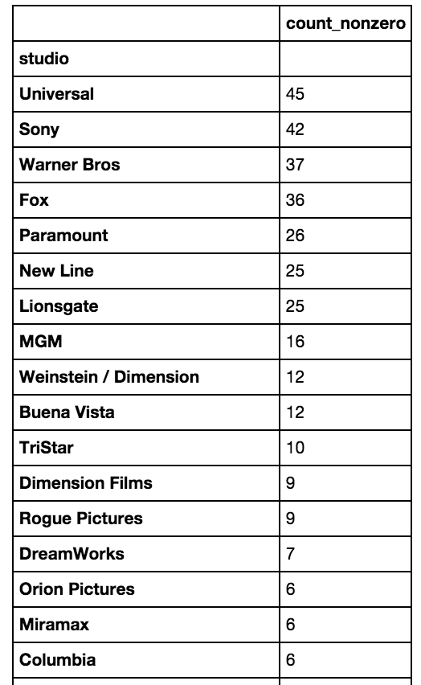

Eric Xu -- luther MVP submission -- 9/16/2014 -- Summary of Progress

Client : A horror filmmaker

Client’s request :  What factors should I consider to increase the total domestic gross of the movie I create?

Dataset : All films from BoxOfficeMojo with keyword "Horror":

  - Horror - Period
  - Horror - Slasher
  - Horror - Supernatural
  - Horror - Terror in the Water
  - Horror - Torture
  - Horror - Anthology
  - Horror - Comedy
  - Horror - Remake
  - Sci-Fi Horror

Features (to choose from in dataset) : 
  -domestic total gross (raw and logged)
  -adjusted total gross (raw and logged) based on number of months since release
  -studio
  -number of theaters at wides release
  -budget
  -month and season of release
  -year of release
  -movie rating (e.g. PG)
  -runtime
-------------------------------------*******************************------------------------------------------------------------
1.  Ultimately, our dependent measure that we want to maximize for the client is total domestic gross.  However, movies that were out longer in the past have an unfair advantage on this measure due to further time for movie and DVD sales to accrue.  In order to account for this, I adjusted the total gross based on the number of months since the film was released from September 2014. 

2.  Since my client is only interested in top studios, I created a table to find out what they were:

As you can see, Universal, Sony, Warner Bros, Fox, Paramount, New Line, and Lionsgate have all created the most horror films.  Thus, I created dummy variables for only these studios to look at their effect in my model.

3.  I was also curious whether the year of the horror film as well as the number of theaters at its widest release had an effect on the adjusted gross.  I scatterplotted both of these independent measures against our dependent measure of adjusted gross.

